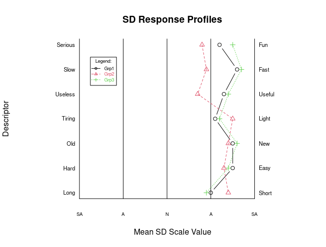
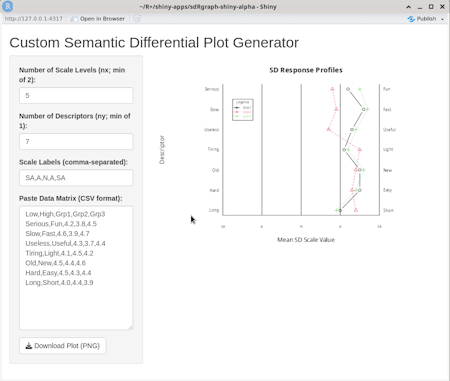

## sdRgraph-shiny-alpha.R
(**Note: An `R` package for this function is at [`sdRgraph`](https://github.com/justineuro/sdRgraph).**)  

An [**R**](https://cran.r-project.org/) [`shiny`](https://shiny.posit.co/) app that features an [**R**](https://cran.r-project.org/) function than can be used for creating ***semantic differential*** (SD) inventory plots (see [Wikipedia: Semantic differential](https://en.wikipedia.org/wiki/Semantic_differential) for more info).  




This directory includes the [`ui.R`](./ui.R)  and [`server.R`](./server.R) files for the `shiny` app. (Note: Only these two file are strictly needed to run the shiny app.  However, you may have to edit some of the graphing parameters in `server.R`, as the need arises, to get better quality plots.)  
To run this app, at the `R` command line (at a Linux terminal `R` session or in an [`rstudio`](https://posit.co/downloads/) `R` session):

```R
library(shiny)
runApp("PATH_TO_DIRECTORY/sdRgraph-shiny-alpha")
```

(... or `runApp("PATH_TO_DIRECTORY/sdRgraph-shiny-alpha/app")`).   
`R` then displays a `localhost` URL at which the app is running, e.g., `http://localhost:4317`.  If you are using [`rstudio`](https://posit.co/downloads/), then an internal `R` browser may automatically open;  this internal browser allows one to open the app in an external browser with a click on `Open in Browser`.  

  
(Note: The data matrix field has to be edited so that the contents are consistent with entered values for the number of scale levels (default of `nx=5`) and descriptors (default of `ny = 7`).  Please see the function description of [`sdRplot.R`](./sdRplot.R) for more details.)

(**Acknowledgements:** [OpenAI's ChatGPT](https://chatgpt.com/) was used to write the codes for this shiny app based on the codes for [`sdRplot.R`](./sdRplot).  Please access the public ChatGPT session at: [URL](https://chatgpt.com/share/68662781-1afc-8002-b2a4-797d0450d084), for more info.)


---
### Additional materials
The following additional related materials from the [`sdRplot`](https://github.com/justineuro/sdRplot) GitHub repository are also included here for convenience but are not needed for running the shiny app.

* [sdRplot.R](./sdRplot.R) - the [**R**](https://cran.r-project.org/) script for creating SD plots (raw source at [sdRplot.R](https://raw.githubusercontent.com/justineuro/sdRplot/master/sdRplot.R))
* [sdRplot-withExamples.R](./sdRplot-withExamples.R) - the [**R**](https://cran.r-project.org/) script with two examples (raw source at [sdRplot-withExamples.R](https://raw.githubusercontent.com/justineuro/sdRplot/master/sdRplot-withExamples.R))
* [sdRplot-withExamples.html](http://justineuro.github.io/sdRplot/sdRplot-withExamples.html) - a [**knitr**](http://yihui.name/knitr/)-generated output of the two examples given in the latter part of the script (HTML source at [sdRplot-withExamples.html](./sdRplot-withExamples.html)).  Note that when you source [sdRplot-withExamples.R](./sdRplot-withExamples.R) on the `R` console, only the plot from the second example (single profile) will usually appear on your graphics device unless you set your graphics device to draw two plots on one page, e.g., by using `par(mfrow=c(2,1))`.
  
  
<a rel="license" href="http://creativecommons.org/licenses/by/4.0/"></a><br /><span xmlns:dct="http://purl.org/dc/terms/" property="dct:title">sdRgraph-shiny-alpha</span> by <a xmlns:cc="http://creativecommons.org/ns#" href="https://github.com/justineuro/" property="cc:attributionName" rel="cc:attributionURL">Justine Leon A. Uro</a> is licensed under a <a rel="license" href="http://creativecommons.org/licenses/by/4.0/">Creative Commons Attribution 4.0 International License</a>.<br />Based on a work at <a xmlns:dct="http://purl.org/dc/terms/" href="https://github.com/justineuro/sdRgraph-shiny-alpha" rel="dct:source">https://github.com/justineuro/sdRgraph-shiny-alpha</a>.